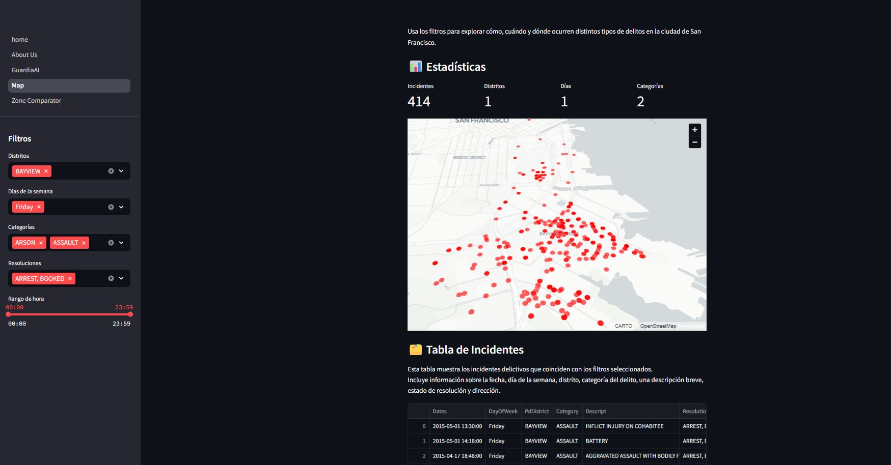
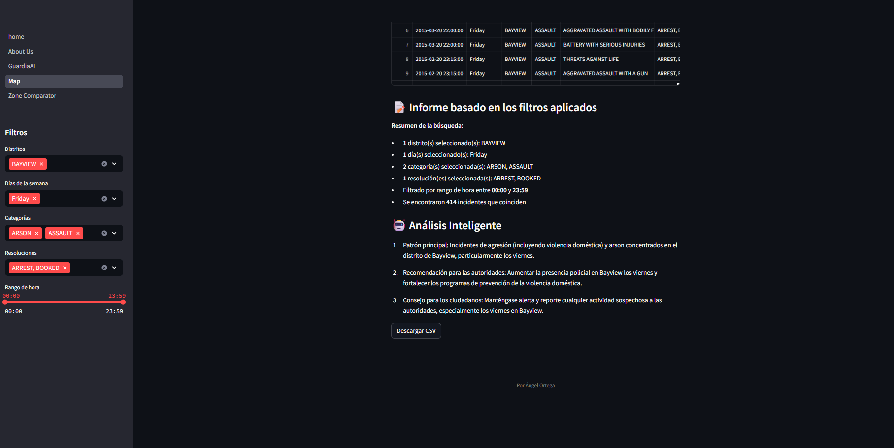
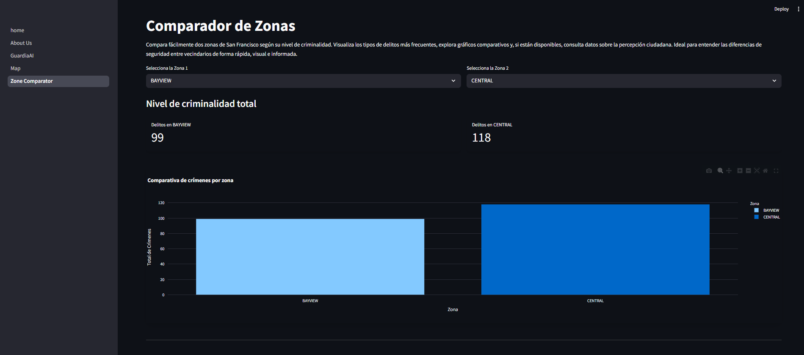
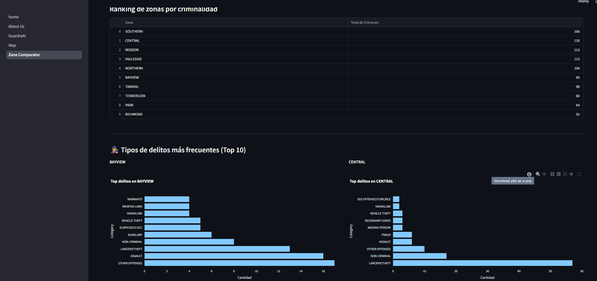
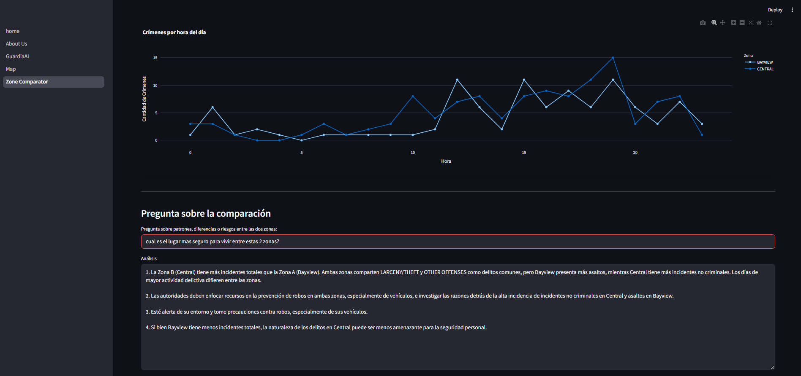
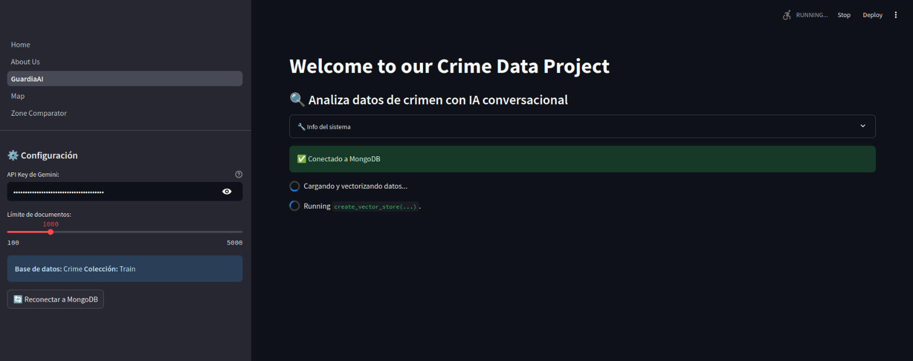
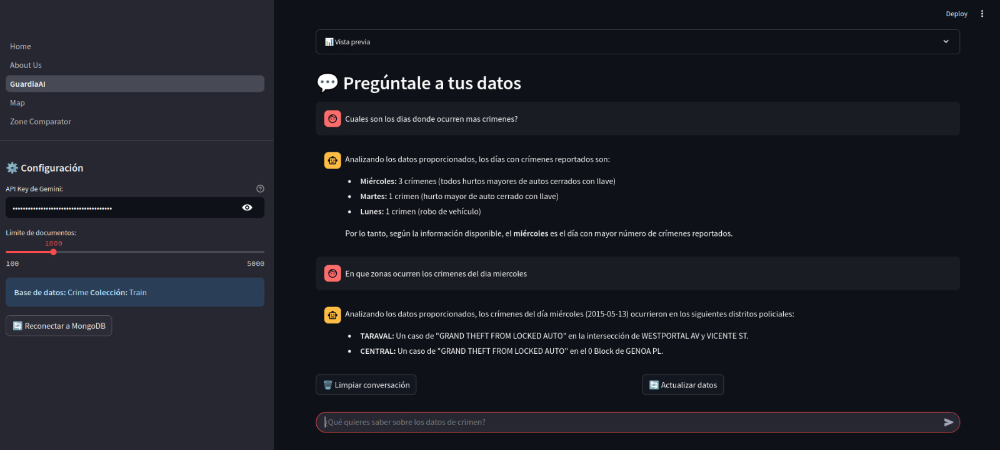

<div align="center">
  
  <h2>
    Crime.io predictor  🚨
  </h2>
</div>

<div align="center">
    <a href="https://github.com/your_username/proyecto_crimen/blob/main/LICENSE">
        
    </a>
    <a href="https://github.com/your_username/proyecto_crimen/releases">
        
    </a>
    <a href="https://github.com/your_username/proyecto_crimen/issues">
        
    </a>
    <a href="https://github.com/your_username/proyecto_crimen/graphs/contributors">
        
    </a>
</div>

<div align="center">
  Data visualization and analysis system for crime statistics — Final Statistics Project.
</div>

---

<div align="center">
<h2>
🚀 Features
</h2>
</div>

<details>
<summary>📌 Interactive Map</summary>
<br>

<div align="center">

<p style="font-family: 'Georgia', serif; font-size: 18px;">
Geographic visualization of crime incidents filtered by district, date, and crime type. Includes interactive markers and clustering for high-density areas.
</p>

1. **Interactive Map**


2. **Intelligent analysis**


</div>
</details>


<details>
<summary>Zone comparison </summary>
<br>

<div align="center">

<p style="font-family: 'Georgia', serif; font-size: 18px;">
Dashboard with with the comparison of the zones of interest.
</p>

1. **zone comparison**


2. **Comparison of the zones of interest**


3. **integrated of chatbot to ask any question about the zones**



</div>
</details>

<details>
<summary>🔍 Predictive Model</summary>
<br>

<div align="center">

<p style="font-family: 'Georgia', serif; font-size: 18px;">
Machine learning model to predict high-risk zones based on historical data. Includes probabilities and evaluation metrics.
</p>

1. **Rag implementation**  


2. **Ask any question about sanfrancisco criminality**


</div>
</details>

<details>
<summary>👥 Team</summary>
<br>

<div align="center">

<p style="font-family: 'Georgia', serif; font-size: 18px;">
Team members and roles in the project: data analysis, visual development, and statistical modeling.
</p>

<table class="team-table">
    <tr>
        <th>Photo</th>
        <th>Name</th>
        <th>Role</th>
    </tr>
    <tr>
        <td></td>
        <td>Zaid Pantoja</td>
        <td>Model Administrator</td>
    </tr>
    <tr>
        <td></td>
        <td>Santigo Cardenas </td>
        <td>Comparative zones</td>
    </tr>
    <tr>
        <td></td>
        <td>Angel Ortega</td>
        <td>Map feature</td>
    </tr>
    <tr>
        <td></td>
        <td>Andres Aviles</td>
        <td>Comparative zones</td>
    </tr>
</table>

</div>
</details>

---

<div align="center">
<h2>
🤝 Contributing
</h2>
</div>

Contributions are welcome. Please read the [contribution guidelines](/Contributing.md) before submitting changes.

---

<div align="center">
<h2>
📜 License
</h2>
</div>

Licensed under Apache 2.0 — see [LICENSE](/Licence.md).

---

<div align="center">
<h2>
🔧 Technologies Used
</h2>
</div>

<div style="display: grid; grid-template-columns: repeat(auto-fill, minmax(100px, 1fr)); gap: 10px; justify-items: center;" align="center">
  
  
  
  
  
  
</div>

---

<div align="center">
<h2>
💻 Setup
</h2>
</div>

1. Clone the repository:
```bash
git clone https://github.com/Angel-ISO/Crime-io.git

```

2. Install the dependencies:
```bash
pip install -r requirements.txt
```

3. Run the app:
```bash
streamlit run src/Home.py
```

and enjoy! 🚀